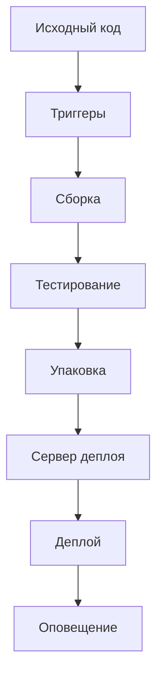

### Шанс вопроса: 46%

Идеальный CI/CD pipeline включает следующие компоненты и этапы:

1. **Исходный код**: Хранилище исходного кода (например, Git).
2. **Триггеры**: Автоматический запуск при каждом коммите или при соблюдении определённых условий.
3. **Сборка**: Сборка проекта с помощью инструмента сборки (например, Maven или Gradle).
4. **Тестирование**: Автоматизированные тесты для обеспечения качества кода.
5. **Упаковка**: Создание артефактов приложения (JAR/WAR файлы, Docker образы и т.д.).
6. **Сервер деплоя**: Платформа для развёртывания приложений.
7. **Деплой**: Развёрнутая среда готова к использованию.
8. **Оповещение**: Уведомления о статусе пайплайна (успешно/неуспешно).

Пример упрощённого CI/CD pipeline:

**Пример использования Jenkins для CI/CD**:

1. **Исходный код**: Хранилище в Git (например, GitHub).
2. **Триггеры**: Настроенные триггеры в Jenkins для запуска пайплайна при каждом коммите.
3. **Сборка**: Использование плагинов Jenkins для сборки проекта с помощью Maven или Gradle.
4. **Тестирование**: Автоматизированные тесты, выполняемые в виртуальной машине с установленными необходимыми инструментами (JDK, Maven).
5. **Упаковка**: Создание артефактов (JAR файла) и подготовка Docker образа для последующего деплоя.
6. **Сервер деплоя**: Использование виртуальной машины или контейнера (например, Docker на сервере).
7. **Деплой**: Развёртывание созданного артефакта на сервере с помощью инструментов управления контейнерами (Docker) или традиционных методов развертывания (например, SSH для копирования файлов).
8. **Оповещение**: Настройка уведомлений о статусе пайплайна через Slack или email.

Этот pipeline обеспечивает непрерывную интеграцию и непрерывное развертывание, позволяя быстро обнаруживать проблемы и устранять их на ранних стадиях.